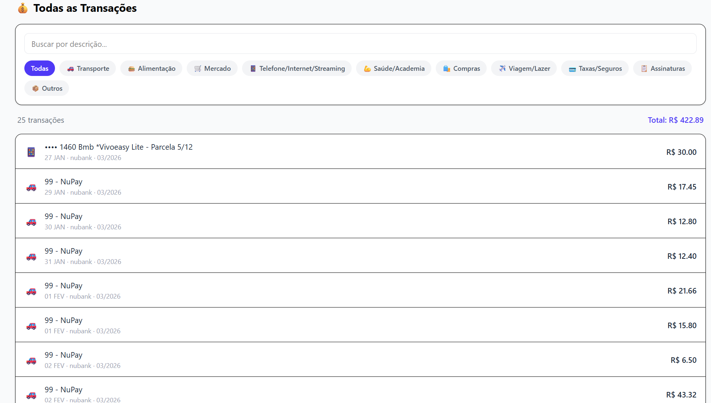
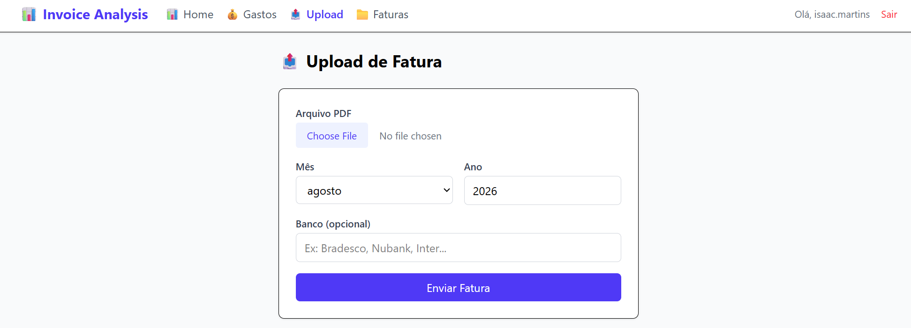
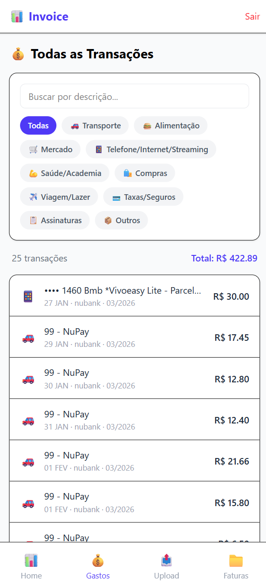

# 📊 Invoice Analysis

**Controle financeiro inteligente com IA local. Seus dados nunca saem do seu computador.**

Faça upload das suas faturas de cartão de crédito em PDF e tenha uma visão completa dos seus gastos — categorizado automaticamente por inteligência artificial, com gráficos interativos e histórico mensal. Escaneie notas fiscais de mercado pelo QR Code e saiba exatamente pra onde vai cada centavo.

## 🔒 Privacidade em Primeiro Lugar

Diferente de apps como Guiabolso, Organizze ou Olivia, este sistema roda **100% na sua máquina**:

- 🤖 **IA local** — Ollama processa suas faturas sem internet
- 💾 **Banco de dados local** — PostgreSQL na sua máquina
- 🚫 **Zero telemetria** — nenhum dado é enviado para servidores externos
- 🔓 **Open source** — audite o código você mesmo

## ✨ Funcionalidades

### Faturas de Cartão
- **Upload de fatura PDF** — suporta Bradesco e Nubank (extensível para outros bancos)
- **Extração precisa** — regex com 100% de acurácia nos valores
- **Detecção automática** — banco, mês e ano extraídos automaticamente do PDF
- **Categorização por IA** — LLM local classifica cada gasto automaticamente
- **Proteção contra duplicatas** — detecta fatura repetida por conteúdo (hash)
- **Validação robusta** — PDF inválido, protegido por senha, banco não suportado

### Notas Fiscais de Mercado
- **Scanner de QR Code** — escaneie o cupom fiscal direto pela câmera do celular
- **Extração automática** — itens, preços, quantidades e loja
- **Normalização inteligente** — IA traduz abreviações ("EXTR POM" → "Extrato de Tomate")
- **Dicionário aprendido** — corrija uma vez, o sistema lembra pra sempre

### Dashboard e Análise
- **Dashboard interativo** — total gasto, distribuição por categoria, evolução mensal
- **Drill-down por categoria** — clique e veja o histórico completo
- **Filtros** — por texto, categoria, mês e ano
- **Categorias customizáveis** — crie, edite ou renomeie categorias (inclusive as padrão)
- **Edição de transações** — mude a categoria de qualquer item

### Geral
- **Mobile-first** — interface responsiva com navegação por abas no celular
- **Multi-usuário** — cada pessoa com sua conta e seus dados separados
- **Mensagens de erro amigáveis** — tudo em português, sem erros técnicos
- **Testes automatizados** — 37 testes unitários cobrindo auth, extração, upload e categorias

## 🛠️ Stack

| Camada | Tecnologia |
|--------|-----------|
| Frontend | React + Vite + Tailwind CSS + Recharts |
| Backend | FastAPI (Python) |
| Banco de dados | PostgreSQL |
| IA | Ollama (llama3.1:8b) — 100% local |
| Scanner | jsQR + Web Camera API |
| Testes | pytest + httpx |
| Deploy | Docker Compose |

## 🚀 Como Rodar

### Pré-requisito

- [Docker](https://docs.docker.com/get-docker/) instalado

### Um comando sobe tudo:

```bash
docker-compose up --build
```

Na primeira execução, o modelo de IA (~4.7GB) será baixado automaticamente. Depois fica em cache.

Acesse: **http://localhost:3000**

### Com GPU NVIDIA (opcional, pra performance):

Descomente o bloco `deploy` no serviço `ollama` do `docker-compose.yml`:

```yaml
deploy:
  resources:
    reservations:
      devices:
        - driver: nvidia
          count: 1
          capabilities: [gpu]
```

### Desenvolvimento local (sem Docker):

```bash
# PostgreSQL
docker run -d --name pg-invoice -e POSTGRES_DB=invoice_analysis -e POSTGRES_PASSWORD=postgres -p 5432:5432 postgres:16-alpine

# Ollama
ollama pull llama3.1:8b

# Backend
cd backend
pip install -r requirements.txt
cp .env.example .env
uvicorn app.main:app --reload --port 8000

# Frontend
cd frontend
npm install
npm run dev
```

### Rodar testes:

```bash
cd backend
python -m pytest tests/ -v
```

## 📱 Screenshots

### Dashboard


### Upload de Fatura


### Mobile


## 🏦 Bancos Suportados

| Banco | Status |
|-------|--------|
| Bradesco | ✅ Suportado |
| Nubank | ✅ Suportado |
| Inter | 🔜 Em breve |
| C6 Bank | 🔜 Em breve |
| Itaú | 🔜 Em breve |

Quer adicionar suporte a outro banco? Basta criar um novo extrator em `backend/app/services/extractor.py` com o regex do formato da fatura.

## 🏗️ Arquitetura

```
Invoice_Analysis/
├── docker-compose.yml
├── backend/
│   ├── app/
│   │   ├── api/              ← Rotas (auth, invoices, transactions, categories, receipts)
│   │   ├── models/           ← User, Invoice, Transaction, Category, Receipt, ReceiptItem
│   │   ├── services/
│   │   │   ├── extractor.py        ← Regex por banco (100% preciso)
│   │   │   ├── llm.py              ← Categorização via Ollama
│   │   │   ├── pdf.py              ← Extração e validação de PDF
│   │   │   ├── receipt_parser.py   ← Parser de NFC-e (nota fiscal)
│   │   │   ├── product_normalizer.py ← Dicionário + LLM pra nomes de produtos
│   │   │   └── auth.py             ← JWT auth
│   │   └── main.py
│   ├── tests/                ← 37 testes unitários
│   └── Dockerfile
├── frontend/
│   ├── src/
│   │   ├── pages/            ← Dashboard, Upload, Invoices, Transactions, Categories, Receipts
│   │   ├── components/       ← Layout com nav mobile
│   │   └── services/         ← Axios config, error handler
│   └── Dockerfile
```

## 🤝 Contribuição

Contribuições são bem-vindas! Especialmente:

- **Novos bancos** — adicione regex para extrair transações de outros bancos
- **Melhorias na categorização** — refine o prompt do LLM ou adicione regras
- **Interface** — melhorias de UX, novos gráficos, dark mode
- **Testes** — aumente a cobertura

### Como contribuir

1. Fork o projeto
2. Crie sua branch (`git checkout -b feat/novo-banco`)
3. Commit suas mudanças (`git commit -m 'feat: suporte ao banco X'`)
4. Push (`git push origin feat/novo-banco`)
5. Abra um Pull Request

## 📜 Licença

[MIT](LICENSE)
