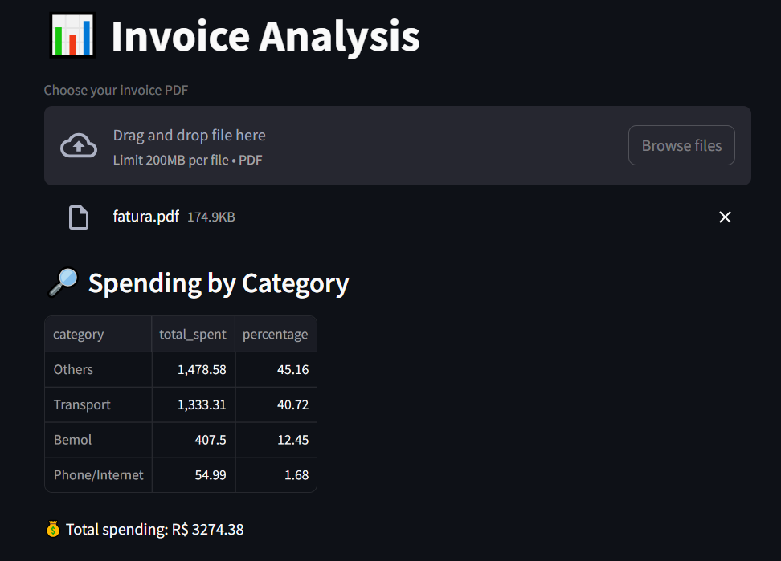
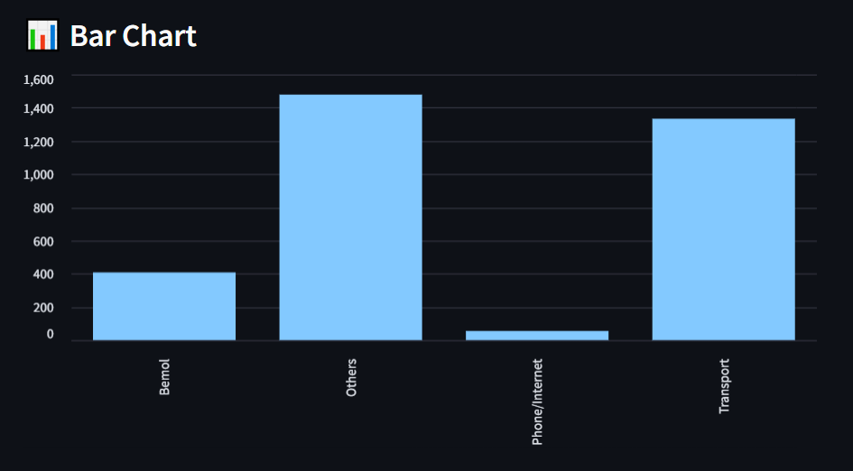

# 📊 Interactive Invoice Analysis with Streamlit






## 📋 Description

This project allows users to **analyze PDF invoices interactively** using Streamlit and Plotly. The app extracts transactions from the uploaded PDF, categorizes expenses automatically, and displays interactive tables and charts to visualize spending patterns. Perfect for personal finance tracking or simple financial data analysis.

## 🚀 Features

- Upload PDF invoices and extract transactions automatically.  
- Categorize expenses into Transport, Grocery, Phone/Internet, Bemol, and Others.  
- Interactive bar chart showing total spending by category.  
- Interactive pie chart showing percentage distribution of expenses.  
- List all transactions for each category.  
- Fully containerized with Docker for easy deployment.  

## 🛠️ Technologies Used

- **Python 3.9+** for backend and data processing.  
- **Streamlit** for building the interactive web application.  
- **Pandas** for data manipulation and analysis.  
- **pdfplumber** for PDF extraction.  
- **Plotly Express** for interactive visualizations.  
- **Docker** for containerization and deployment.  

## 📦 Installation

### Requirements

- Python 3.9+
- Streamlit
- Pandas
- pdfplumber
- Plotly

### Installation Steps

1. Clone the repository:
    ```bash
    git clone https://github.com/your-username/invoice-analysis.git
    cd invoice-analysis
    ```

2. Using Docker (recommended):
    ```bash
    # Build the Docker image
    docker build -t invoice-analysis .

    # Run the container
    docker run -p 8501:8501 invoice-analysis
    ```
    Open your browser and go to:
    ```
    http://localhost:8501
    ```

3. Using a Python virtual environment (optional):
    ```bash
    # Create and activate virtual environment
    python -m venv venv
    source venv/bin/activate  # Linux/Mac
    venv\Scripts\activate     # Windows

    # Install dependencies
    pip install -r requirements.txt

    # Run the app
    streamlit run app.py
    ```

---

## 🧑‍💻 Contribution

Contributions are welcome! Feel free to submit pull requests or report issues on the [Issues page](https://github.com/your-username/invoice-analysis/issues).

### Contribution Steps

1. Fork the project.  
2. Create a branch for your feature (`git checkout -b feature/new-feature`).  
3. Commit your changes (`git commit -am 'Add new feature'`).  
4. Push to the branch (`git push origin feature/new-feature`).  
5. Create a Pull Request with a detailed description of your changes.  

---

## 📜 License

This project is licensed under the [MIT License](LICENSE).  
